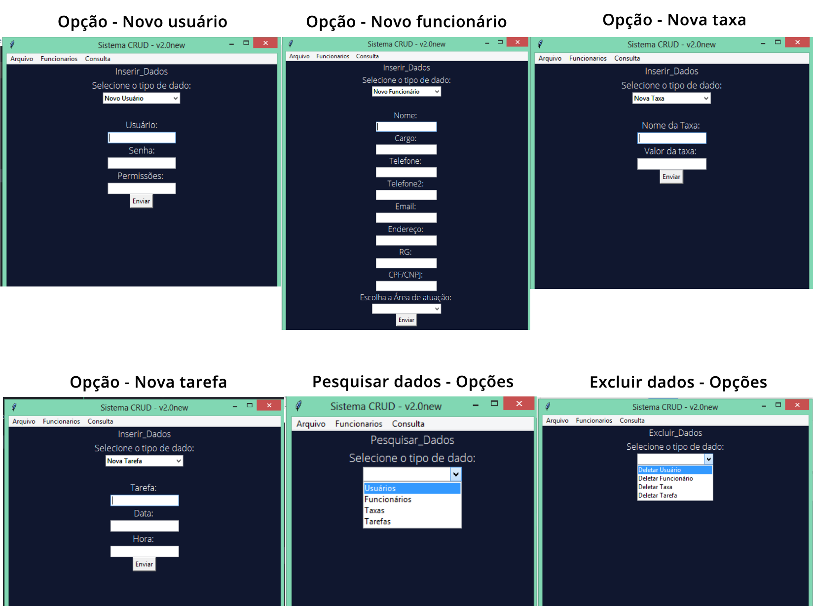

<h1 align = "center"> Sistema CRUD </h1>

# Sobre
Sistema CRUD usando Python e Tkinter, com foco na área empresarial, que manipula dados como usuários, empregados, taxas usadas pela companhia e tarefas. Também faz cálculos de orçamento.

Esse projeto foi desenvolvido visando automatizar algumas tarefas empresariais, como a realização de orçamentos e a manutenção de um cadastro de funcionários. Dentre as funções previstas para o projeto estão:

- Sistema de usuário com permissões, permitindo acesso a informações separadas e mais relevantes a cada tipo de usuário.
- Criação de Cadastro de funcionários.
- Inserção de valores de taxas personalizadas (Que podem ser usadas na realização do orçamento, ou apenas para consulta posterior).
- Criação de tarefas por usuário.
- Visualização dos dados de usuário, funcionários, taxas e tarefas.
- Edição dos dados de usuário, funcionários, taxas e tarefas.
- Exclusão dos dados de usuário, funcionários, taxas e tarefas.
- Utilização de arquivo externo de configuração, permitindo algumas informações do programa de forma dinâmica (como textos e logo).
- Criação do arquivo externo de configuração pelo aplicativo.
- Tela de carregamento (por hora, simbólica) com logo personalizada da empresa.
- Possibilidade de importação e exportação do arquivo de configuração, permitindo o backup e/ou uso em outra plataforma que contenha o programa.
- Possibilidade de realização de diversos tipos de orçamentos, separados de acordo com a permissão do usuário/sua área de atuação na empresa.

Observação: Nem todos os recursos podem estar implementados e/ou funcionando corretamente. Para verificar quais são as funcionalidades implementadas consulte a guia "[Funcionalidades](#Funcionalidades)", mais abaixo.

# Índice

* [Sobre](#sobre)
* [Índice](#índice)
* [Funcionalidades](#funcionalidades)
* [Demonstração](#demonstração)
* [Pré Requisitos](#pré-requisitos)
* [Tecnologias](#tecnologias)
* [Autor](#autor)


# Funcionalidades
- [x] Sistema de usuário com permissões
- [x] Criação de Cadastro de funcionários.
- [x] Inserção de valores de taxas personalizadas.
- [ ] Criação de tarefas por usuário.
- [x] Visualização dos dados de usuário, funcionários, taxas e tarefas. (Tarefas ainda não)
- [ ] Edição dos dados de usuário, funcionários, taxas e tarefas.
- [x] Exclusão dos dados de usuário, funcionários, taxas e tarefas. (Tarefas ainda não)
- [x] Utilização de arquivo externo de configuração.
- [ ] Criação do arquivo externo de configuração pelo aplicativo.
- [x] Tela de carregamento (por hora, simbólica) com logo personalizada da empresa.
- [ ] Possibilidade de importação e exportação do arquivo de configuração.
- [ ] Possibilidade de realização de diversos tipos de orçamentos.

# Demonstração
<div align = "center">

<div>
<h3>Imagens da tela</h3>
<br>


</div>

<div> OBS: A opção novo usuário está disponível somente para usuários com permissões de admin</div>
</div>

# Pré Requisitos

- Python 3
- Biblioteca Pillow (no terminal de sua preferência, executar ```pip install pillow``` para instalá-lo no sistema)


# Tecnologias

- [Python](https://www.python.org/)
- [Editor de código ATOM](https://atom.io/)
- [Extensão Terminus para o ATOM](https://atom.io/packages/terminus)


# Autor
### Johann Herrero Cavadas
[](https://www.linkedin.com/in/jherrerocavadas/)
[](mailto:jherrerocavadas@gmail.com?Subject=Contato%20github%20-%20Repositório%20Sistema_CRUD)
